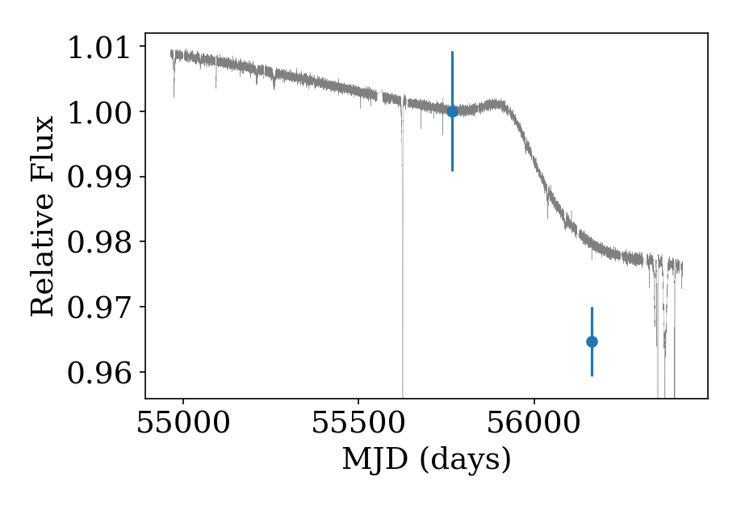

# GALEX_Boyajian

An exploration of the long and short timescale observations available from GALEX for KIC 8462852.

Takeaway: the gradual dimming for this star appears to be confirmed by these data. Also, the dimming is quite grey (little dependence on wavelength), disfavoring dust extinction as the culprit.
